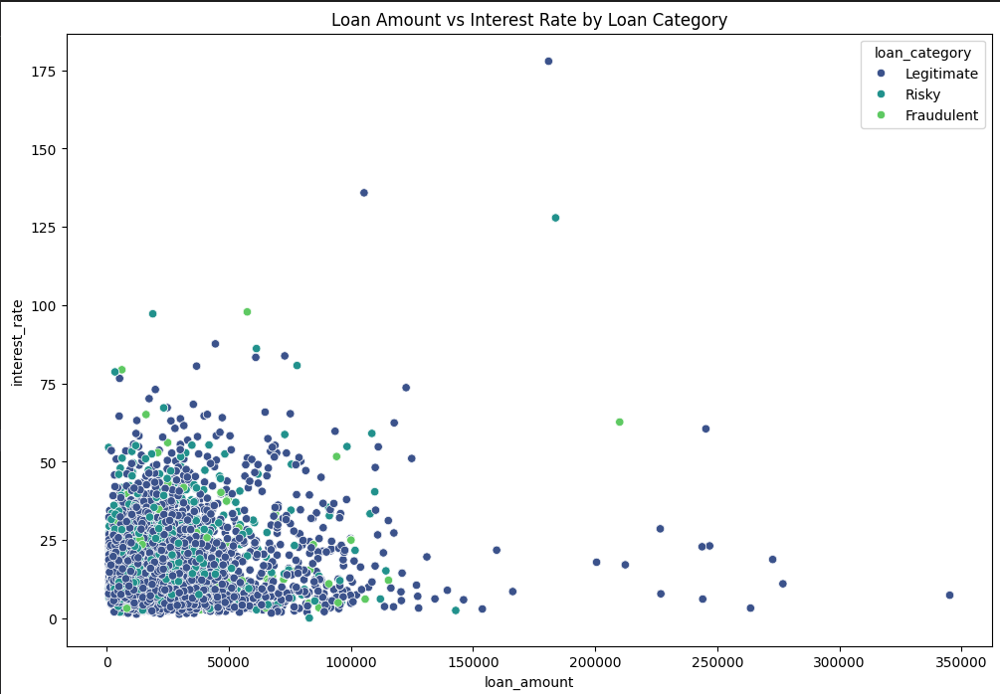
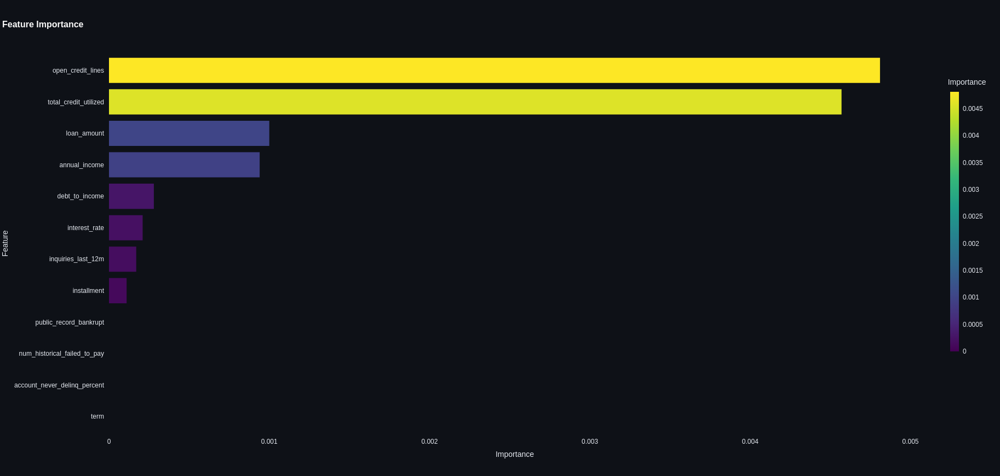
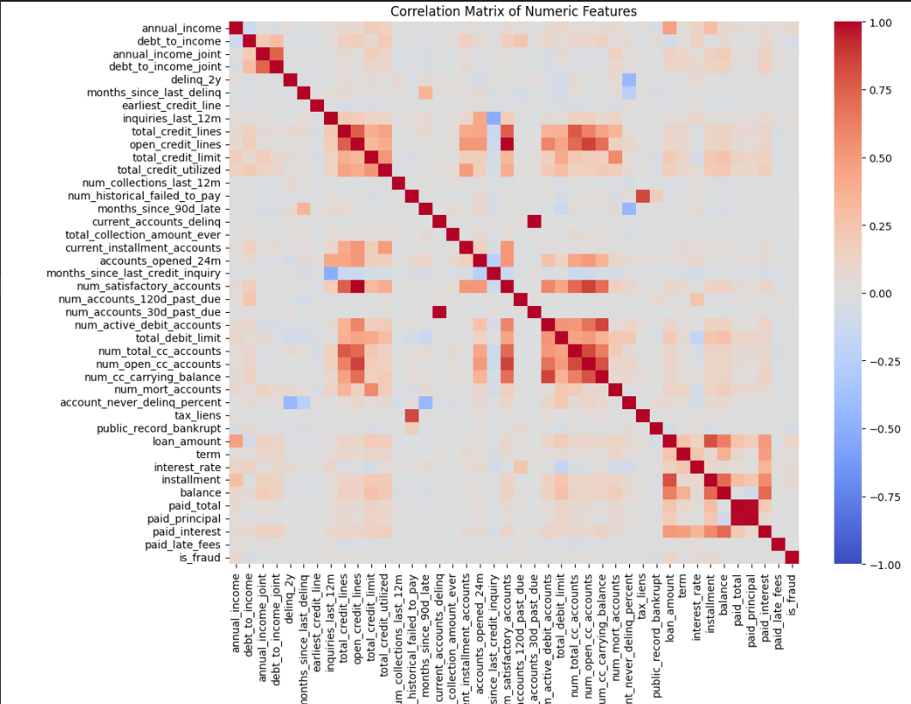
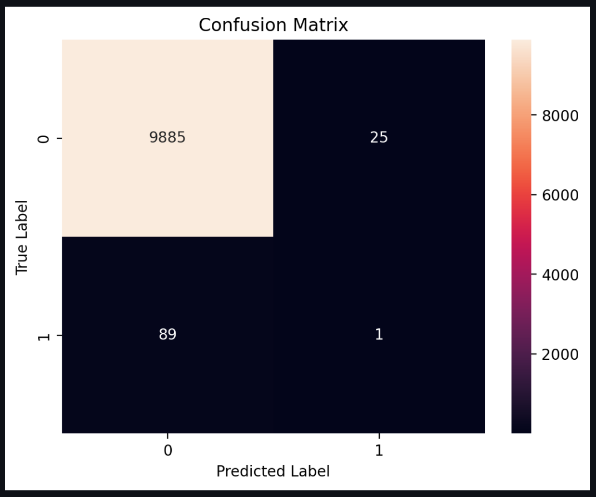
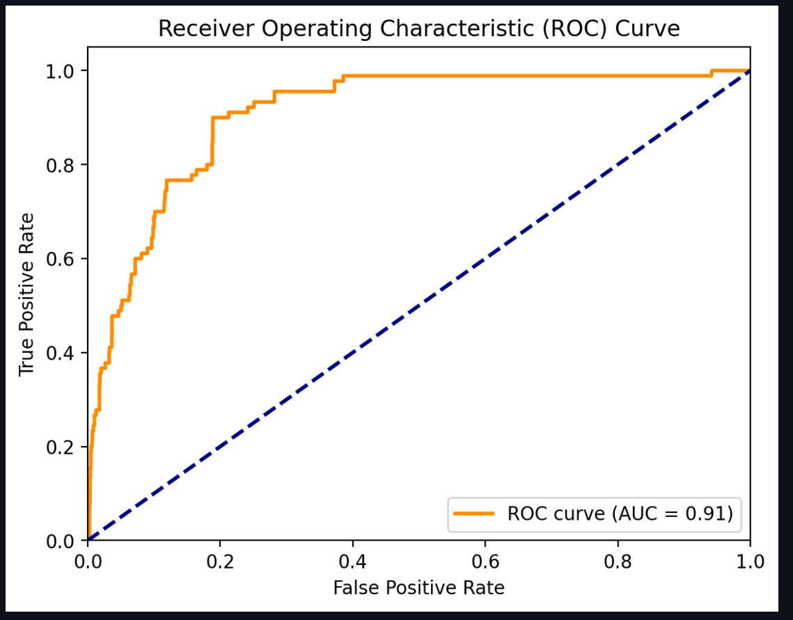

# Fraud Detection Loan Analysis Project

## Project Overview

This project leverages **machine learning** to detect **fraudulent loan applications** using a large dataset of historical loan records. The objective is to **classify loan applications** into categories such as **normal, risky, or fraudulent**, and visualize important features that contribute to the model's predictions. The results are displayed in an interactive **Streamlit app**, providing valuable insights for detecting financial crimes, a critical component of **transaction monitoring (TM)** systems.

### Key Responsibilities Highlighted in This Project

This project demonstrates several key skills and responsibilities that align with the requirements for the analyst role at Deloitte, including:

- **Model Analysis**: Detailed analysis of important features such as loan amount, interest rate, debt-to-income ratio, and annual income using boxplots and scatterplots.
- **Data Visualization**: Development of advanced data visualizations such as correlation heatmaps and feature importance charts to better understand the model's performance.
- **Fraud Detection**: Implementation of **machine learning** models to detect fraudulent behavior in loan applications, contributing to the identification and mitigation of **financial crime risks**.
- **Model Risk Methodology**: Incorporation of **model validation** practices by assessing feature importance and detecting anomalies in the dataset, a critical aspect of ensuring model reliability.
- **Stakeholder Collaboration**: The project emphasizes data clarity and effective visualization, which supports collaboration with compliance teams and other stakeholders.

## Technology Stack

- **Python**: Core programming language for data analysis, machine learning, and visualization.
- **Streamlit**: Framework for building interactive web apps to visualize results.
- **Pandas**: Library for data manipulation and analysis.
- **Seaborn & Matplotlib**: For advanced data visualization.
- **Scikit-learn**: Used for model building, training, and evaluation.
- **Plotly Express**: For interactive visualizations within the Streamlit app.

## Features

### 1. **Loan Data Visualization**

We implemented various visualizations to help analyze important features across different loan categories. This includes:
- **Boxplots**: Visualizing the distribution of key features (`loan_amount`, `interest_rate`, `annual_income`, `debt_to_income`) for normal, risky, and fraudulent loans.
- **Scatter Plot**: Showing the relationship between loan amount and interest rate, color-coded by predicted fraud status.



### 2. **Feature Importance**

Using permutation importance, we identified the most significant features that influence the model's prediction of fraud. This analysis is critical for understanding which variables should be prioritized in **transaction monitoring** models.



### 3. **Correlation Heatmap for Fraudulent Loans**

A correlation heatmap was generated specifically for fraudulent loans to help understand the relationships between key features such as loan amount, interest rate, and debt-to-income ratio. These correlations provide insight into patterns and dependencies among fraudulent cases.



### 4. **Anomaly Detection**

We applied anomaly detection techniques to identify loans that deviate significantly from the average in terms of key metrics. This is particularly useful for spotting potentially fraudulent activity.

### 5. **Model Evaluation**

- **Confusion Matrix**: A visualization of the model's accuracy in classifying loans into different categories (normal, risky, and fraudulent).

- **ROC Curve**: A graphical representation of the model’s performance, showing its true positive rate versus false positive rate across different threshold levels.



## Instructions

Follow the steps below to run the project:

1. Clone the repository:
   ```bash
   git clone https://github.com/yourusername/fraud_detection_project.git
   cd fraud_detection_project

2. Install dependencies:
    ```bash
    Copy code
    pip install -r requirements.txt
    Run the Streamlit app:

3. Run the Streamlit app:
    ```bash
    Copy code
    streamlit run fraud_detection_app.py

4. Explore the interactive visualizations in the app and download results if needed.


### Conclusion: The Power of Cybersecurity and Data Science in Financial Crime Detection

The intersection of **cybersecurity** and **data science** is increasingly becoming critical to financial institutions, particularly in addressing the growing threats of **financial crimes**. Fraudulent activities, such as money laundering, insider trading, and loan fraud, require complex detection systems that can quickly adapt to new types of threats.

In this project, **data science techniques** like **machine learning** were applied to build predictive models for detecting fraud in loan applications. By analyzing key features—such as loan amounts, interest rates, and debt-to-income ratios—the project demonstrated how advanced algorithms can automatically classify loan applications and detect anomalies.

### The Role of Cybersecurity

**Cybersecurity** plays a pivotal role in protecting financial systems, ensuring that fraudulent transactions or data breaches are detected and mitigated in real-time. Implementing robust **fraud detection algorithms** in combination with secure infrastructure helps financial institutions avoid significant financial losses and reputational damage.

### Combining Cybersecurity and Data Science

When data science is combined with cybersecurity, it brings several advantages to financial institutions:
- **Proactive Threat Detection**: Advanced algorithms can spot unusual patterns or outliers in transactional data, which may signal fraud attempts or insider threats.
- **Real-time Monitoring**: By embedding fraud detection systems into the core of transaction monitoring platforms, financial institutions can flag and stop suspicious activity as it occurs.
- **Automated Response Systems**: Machine learning models can trigger automated responses to fraudulent behavior, improving response time and reducing manual intervention.

In the evolving financial space, leveraging data science for **cybersecurity** ensures that companies stay ahead of emerging threats. Whether through enhanced **fraud detection**, improved **anomaly detection**, or more secure financial operations, this combination of fields enhances an institution's ability to guard against financial crime.